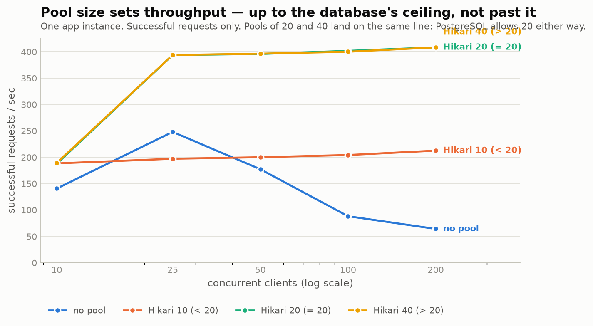
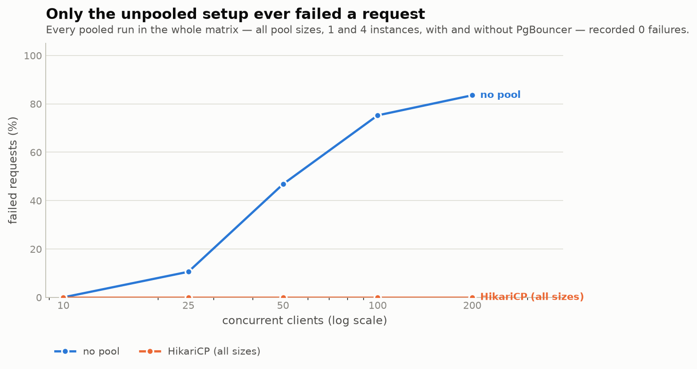
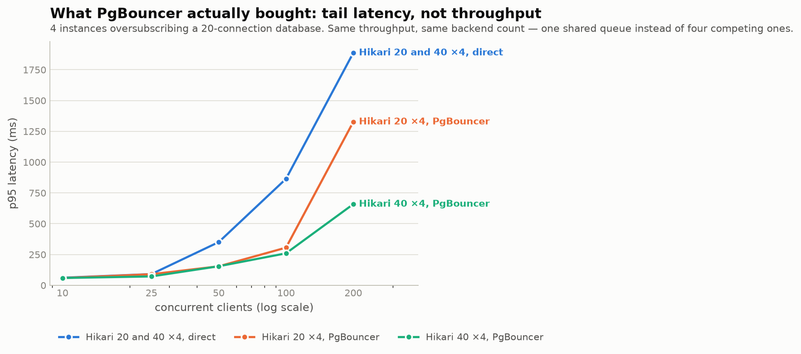
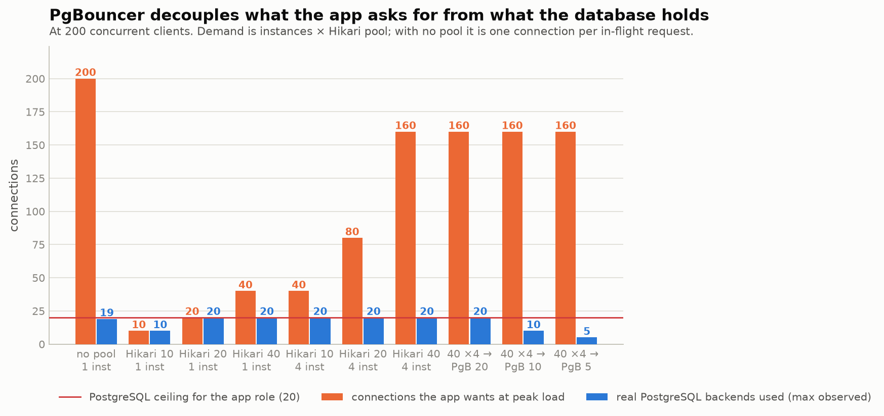
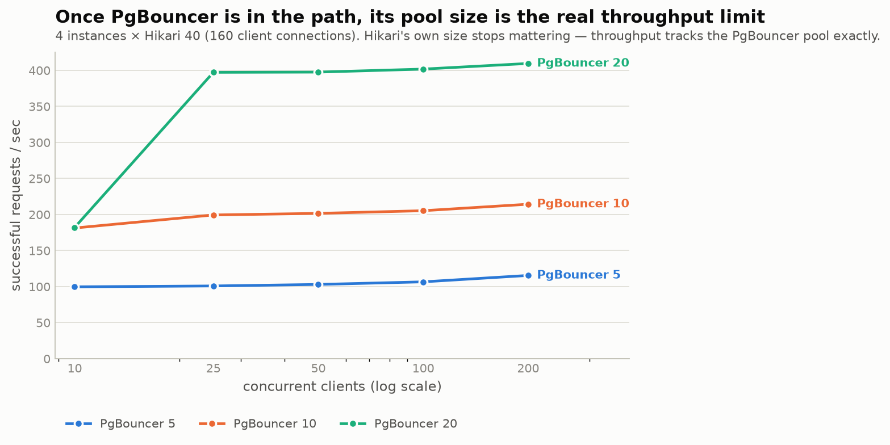

# Pool sizing benchmark — results

17 configurations × 5 concurrency levels, all measured on a live PostgreSQL 16,
a live PgBouncer 1.22 and real Spring Boot instances. Method, topology and
limitations are in [README.md](README.md); raw output is in
[results/matrix.json](results/matrix.json) and [results/matrix.csv](results/matrix.csv);
per-run tables are in [results/tables.md](results/tables.md).

**Setup in one line:** PostgreSQL allows the app role **20 backends**
(`max_connections=25`, `superuser_reserved_connections=5`, app runs as a
non-superuser). Each request holds its connection for **50ms**, so the arithmetic
ceiling is `connections ÷ 0.050` — 10 connections → 200 req/s, 20 → 400 req/s.
Every measured number below lands on that line, which is the main reason to trust them.

---

## The short version

| # | Finding |
|---|---|
| 1 | **Not pooling is the only thing that actually broke.** 83.5% of requests failed at 200 concurrent clients, and successful throughput *fell* to 64 req/s — 6.4× worse than a pooled setup. |
| 2 | **HikariCP pool size sets throughput, exactly** — until it hits the database ceiling, after which extra pool size buys nothing. |
| 3 | **Oversizing HikariCP did not break anything.** Asking for 160 connections against a 20-connection database still gave 0 errors. HikariCP absorbs it — with one important caveat (see below). |
| 4 | **PgBouncer's measured win was tail latency, not throughput or errors**: p95 **1887ms → 658ms** (2.9×) in the most oversubscribed case, at identical throughput. |
| 5 | **Once PgBouncer is in the path, its pool size is the real limit** — and setting it too low throttles you silently, with zero errors to alert on. |

---

## 1. Only PostgreSQL direct connection





| concurrency | successful req/s | failed | p95 |
|---:|---:|---:|---:|
| 10 | 140.6 | 0% | 85ms |
| 25 | 248.0 | **10.6%** | 128ms |
| 50 | 177.3 | **46.8%** | 249ms |
| 100 | 88.2 | **75.2%** | 766ms |
| 200 | 64.1 | **83.5%** | 1828ms |

**Where it breaks down: between 10 and 25 concurrent clients.** With no pool, the
number of open connections *is* the number of in-flight requests, so the app walks
straight into the database's 20-connection ceiling the moment concurrency passes it.

The failures are not vague. Across the run, 11,136 requests failed to get a
connection, and the PostgreSQL side of it
([evidence](results/evidence/S1-nopool-failure-causes.txt)) was:

```
9586  FATAL: remaining connection slots are reserved for roles with the SUPERUSER attribute
1550  FATAL: sorry, too many clients already
```

Two things are worth pulling out:

- **It gets worse, not just slower.** Successful throughput peaks at 248 req/s and
  then *collapses* to 64 req/s. Beyond the ceiling the app spends its effort opening
  connections that get refused, so added load actively destroys capacity.
- **Even when nothing fails, it is slower.** At 10 concurrent clients — comfortably
  inside the limit, 0% errors — it managed 140.6 req/s against 188.3 for the same
  workload with a pool. That ~25% is pure connection setup (TCP + SCRAM auth) paid
  on every single request.

## 2. PostgreSQL + HikariCP

**Single instance** — pool size sets throughput, exactly as the arithmetic predicts:

| Hikari pool | vs PG pool (20) | peak req/s | predicted (pool ÷ 50ms) | failed | PG backends held |
|---|---|---:|---:|---:|---:|
| 10 | `<` | 212.5 | 200 | 0% | **10** |
| 20 | `=` | 408.3 | 400 | 0% | **20** |
| 40 | `>` | 408.3 | 400 (capped) | 0% | **20** |

Pool 40 and pool 20 produce the *same* line, because PostgreSQL grants 20 either
way. Past the database's ceiling, pool size is a number that changes nothing.

**Four instances** — demand of 40, 80 and 160 against a 20-connection database:

| Hikari pool ×4 | total demand | peak req/s | failed | PG backends held |
|---|---:|---:|---:|---:|
| 10 ×4 | 40 | 408.5 | **0%** | 20 |
| 20 ×4 | 80 | 408.0 | **0%** | 20 |
| 40 ×4 | 160 | 408.3 | **0%** | 20 |

**This is the result that contradicts the obvious expectation, so it is worth being
precise about.** Asking for 160 connections from a database that allows 20 produced
no errors at all. HikariCP asks for a connection, PostgreSQL refuses, HikariCP
retries inside its `connection-timeout` (5s here) — and because each query holds a
connection for only 50ms, a slot frees up long before that timeout expires. The
system quietly self-limits at the database's ceiling instead of failing.

**The caveat that matters:** this holds because query time (50ms) is very short
relative to `connection-timeout` (5s). Make queries slow, or the timeout tight, and
the retry window stops covering the wait — at which point the same configuration
starts throwing `SQLTransientConnectionException: Connection is not available`.
This benchmark did not measure that regime, so do not read these zeros as
"oversizing Hikari is always safe". Read them as "oversizing Hikari is absorbed as
*queueing*, and queueing is only invisible while queries are fast".

## 3. PostgreSQL + HikariCP + PgBouncer

Throughput, error rate and backend count were **identical** with and without
PgBouncer (~408 req/s, 0%, 20 backends). The difference was in the tail:



| 4 instances | p95 @ 100 clients | p95 @ 200 clients |
|---|---:|---:|
| Hikari 20 ×4, direct | 864ms | 1885ms |
| Hikari 20 ×4, via PgBouncer | 305ms | 1326ms |
| Hikari 40 ×4, direct | 864ms | 1887ms |
| Hikari 40 ×4, via PgBouncer | **259ms** | **658ms** |

**2.9× better p95 at 200 clients, 3.3× at 100 — for free, at the same throughput.**

The mechanism: without PgBouncer there are four independent HikariCP pools, each
retrying blindly against the same 20 slots. Nothing coordinates them, so waiting is
unfair — some requests get a connection quickly, others keep losing the scramble,
and the tail stretches. PgBouncer replaces four competing queues with **one FIFO
queue** in front of 20 server connections. Same work, same capacity, far fairer
waiting.

Notice the effect *grows with oversubscription*: at 40 wanted connections the gain
is modest (865 → 659ms), at 160 it is large (1887 → 658ms). The more instances
compete, the more a shared queue is worth.



## 4. PgBouncer with different pool sizes



All three runs below are 4 instances × Hikari 40 — 160 client-side connections:

| PgBouncer pool | peak req/s | predicted (pool ÷ 50ms) | PG backends held | p95 @ 200 |
|---:|---:|---:|---:|---:|
| 5 | 115.4 | 100 | **5** | 2132ms |
| 10 | 214.2 | 200 | **10** | 1314ms |
| 20 | 409.5 | 400 | **20** | 658ms |

**HikariCP's pool size stopped mattering entirely.** All three runs had 160 client
connections configured; throughput tracked the PgBouncer pool and nothing else.

The operational warning: PgBouncer pool 5 gave **4× less throughput** than pool 20
with **zero errors** — nothing in the application logs, no failed requests, no
alarm. Just quiet, permanent throttling. When you put PgBouncer in the path, its
`default_pool_size` silently becomes your real connection limit, and undersizing it
is invisible to every error-based monitor you have.

## 5. A configuration detail worth copying

The app connects as a **non-superuser** and PostgreSQL keeps
`superuser_reserved_connections = 5`. That is why, during the run where 83.5% of
requests were failing, the benchmark's own monitoring queries never once failed —
the database stayed reachable for an operator throughout its worst moment. The
reserved slots do exactly what they exist for, but only if your application is not
itself a superuser.

---

## What this does and does not prove

Honest limits on the above:

- **Single host.** App, PgBouncer and PostgreSQL share a machine, so network latency
  is ~0. This *understates* PgBouncer's real benefit (it amortises connection setup
  across a network that here costs nothing) and *overstates* its overhead (its extra
  hop is pure cost here). The latency comparison in §3 is conservative in PgBouncer's favour.
- **One query shape**, 50ms, read-only, single statement. The §2 "no errors" result
  depends directly on that being short relative to `connection-timeout`.
- **Closed-loop load**: offered load is bounded by `concurrency / latency`, so
  saturation shows up as flat throughput plus rising latency, never as an unbounded queue.
- **Transaction pooling only.** Session-level features (advisory locks across
  statements, `LISTEN/NOTIFY`, session `SET`) are incompatible with it and untested here.
- **Backend counts are sampled** twice a second, so a very brief spike could be missed.
  They agree with the theoretical ceilings in every run, which is the cross-check.

## Practical reading

1. **Always pool.** It is the difference between 408 req/s with no errors and 64
   req/s with 83% errors, on identical hardware.
2. **Size the pool to the database, not to the traffic.** `instances × pool` above
   the database ceiling buys nothing; it converts into queueing you cannot see.
3. **Reach for PgBouncer when many instances share one database.** The win here was
   tail latency and a single place to govern connections — not throughput.
4. **If you deploy PgBouncer, treat `default_pool_size` as a production capacity
   setting** and alert on throughput, not just errors. Undersizing it fails silently.
5. **Do not run the application as a superuser**, so reserved connections can keep
   the database reachable when the app misbehaves.
