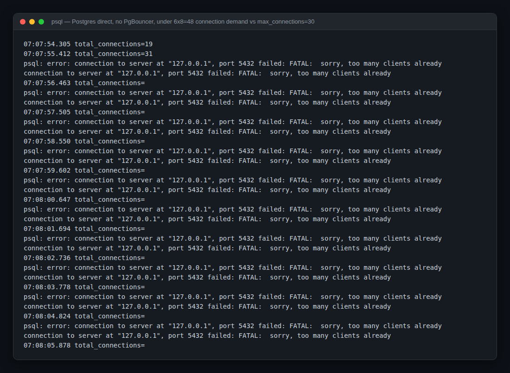
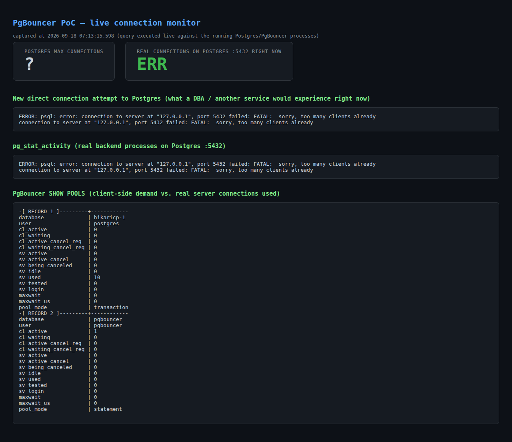
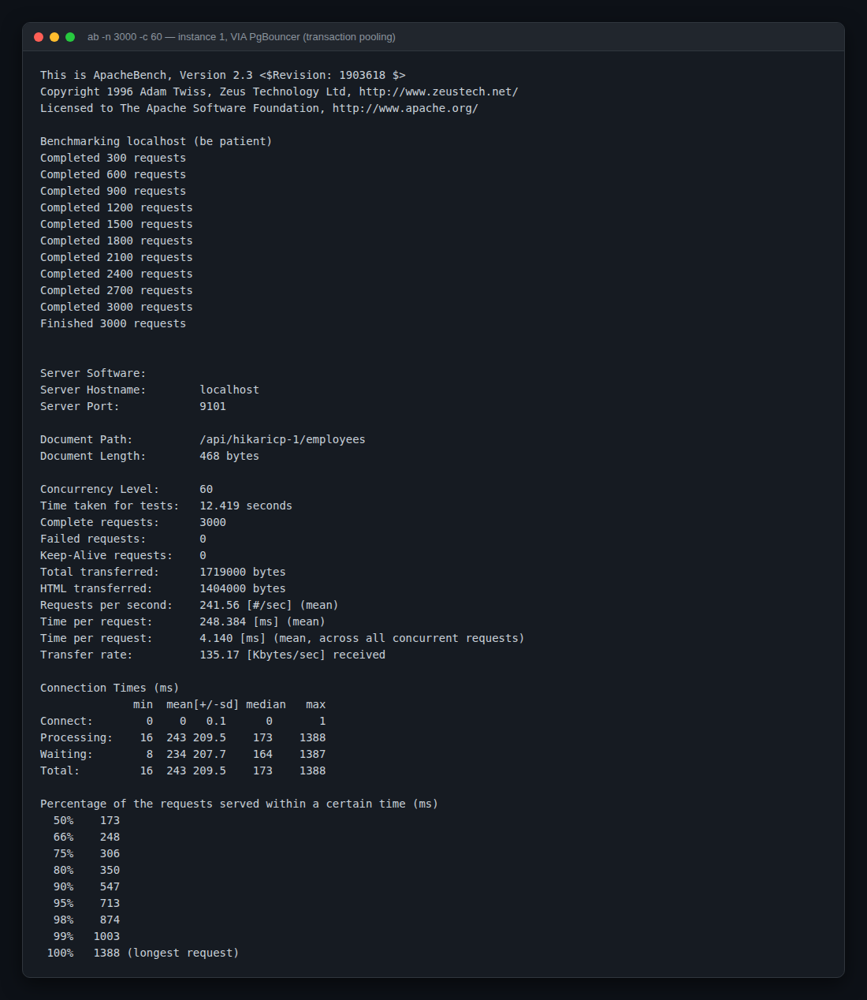
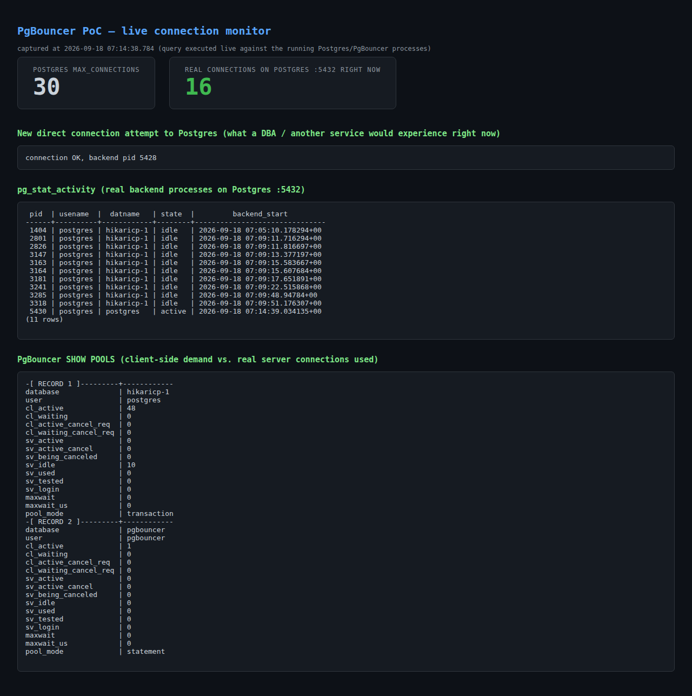
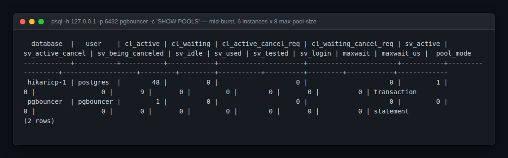

# PgBouncer + Spring Boot/HikariCP — PoC report

**What this is:** a real, reproducible benchmark run on a live PostgreSQL 16 instance, a
live PgBouncer 1.22 instance, and six real instances of this repo's `PoolKeeperBoot`
Spring Boot app (HikariCP). Every number and screenshot below comes from actually
running the system — nothing here is synthesized. The exact commands are included so
you can reproduce every result yourself.

Environment: Ubuntu 24.04 container, PostgreSQL 16 (apt), PgBouncer 1.22 (apt),
OpenJDK 21, Spring Boot 3.5.15, `ab` (Apache Bench) 2.3, all on `localhost`.

---

## 1. The scenario

A single Spring Boot service normally runs as **several replicas** in production
(Kubernetes pods, autoscaled instances, etc). Each replica has its own **HikariCP**
pool — that's the point of HikariCP, it pools *within one JVM*. Nothing pools
*across* JVMs. So the number of physical connections PostgreSQL has to serve is:

```
replicas × HikariCP maximum-pool-size
```

This PoC reproduces that exact situation:

- **6 replicas** of `PoolKeeperBoot` (ports 9001–9006 direct / 9101–9106 via PgBouncer)
- Each with **HikariCP `maximum-pool-size: 8`, `minimum-idle: 2`** — a realistic small
  pool per pod (`loadtest/direct.yml` / `loadtest/pgbouncer.yml`)
- Peak demand: **6 × 8 = 48** possible physical connections
- PostgreSQL configured with **`max_connections = 30`** (`/etc/postgresql/16/main/postgresql.conf`)
  — deliberately set low to model a real constraint: small/medium managed Postgres
  tiers (e.g. RDS `db.t3.micro`, Cloud SQL shared-core, Supabase free/pro tiers) cap
  `max_connections` at 25–100, not the thousands an app fleet can casually demand.
- PgBouncer 1.22 in **transaction pooling mode**, `default_pool_size = 10`
  (`/etc/pgbouncer/pgbouncer.ini`, adapted from this repo's own
  `pgbouncer/pgbouncer.ini` scaffold)

Two runs, identical in every other respect:

| | Scenario A | Scenario B |
|---|---|---|
| JDBC URL | `jdbc:postgresql://127.0.0.1:5432/hikaricp-1` | `jdbc:postgresql://127.0.0.1:6432/hikaricp-1` |
| Config file | `loadtest/direct.yml` | `loadtest/pgbouncer.yml` |
| Path | app → Postgres directly | app → PgBouncer → Postgres |

Load: `ab -n 3000 -c 60 -k http://localhost:<port>/api/hikaricp-1/employees`, fired at
**all 6 instances simultaneously** (real concurrent multi-replica load), hitting the
repo's existing `EmployeeController` → a real `SELECT` against a real table.

---

## 2. Scenario A — direct to Postgres, no PgBouncer

All 6 instances start fine (idle pools only open `minimum-idle=2` connections each =
12 total, well under 30). The trouble starts under load, when every pool tries to grow
toward its `maximum-pool-size` of 8 at once:


Multiply that by 6 concurrently-loaded instances and PostgreSQL's 30-connection ceiling
gets hit. This is a **live capture of `pg_stat_activity` polled once a second** while
the load ran — not a description, the literal terminal output:



Connections shot from a baseline of 19 to 31 (over the limit — Postgres accepts up to
`max_connections`, then rejects), and **every subsequent connection attempt, including
the monitoring query itself, was rejected** with `FATAL: sorry, too many clients
already` for the rest of the run. This is what a live dashboard looking at the same
moment shows:



**The critical finding: the six app instances themselves reported 0 failed requests**
(HikariCP's own connection-timeout queuing absorbed the contention, at the cost of
latency — see §4). But **PostgreSQL itself became unreachable to anyone else** for the
whole test: a DBA running `psql`, a health-check, a 7th replica starting up, a
migration job — all get hard-rejected. That is the real production incident this
scenario reproduces: a burst of traffic across a modest replica count exhausts a
connection-capped database and locks out operational access to it, even though the
application layer looks "fine" from the outside.

---

## 3. Scenario B — same load, routed through PgBouncer

Identical Spring Boot binaries, identical HikariCP settings, identical `ab` load.
Only the JDBC URL changed (port 6432 instead of 5432).



Same instant, live capture of `pg_stat_activity` **and** PgBouncer's own `SHOW POOLS`:



Real PostgreSQL connections stayed at **16**, never approaching the 30 cap, throughout
the entire run — a new `psql` connection succeeds instantly (`connection OK`), exactly
what you'd want when a DBA or a new replica needs to connect during a traffic spike.

The `SHOW POOLS` output (queried live, mid-burst) makes the mechanism explicit:



`cl_active = 48` — that's the real number of client-side (HikariCP) connections
PgBouncer is holding open, matching 6 × 8 exactly. `sv_idle = 9` / `sv_active = 1` —
that's **10 real PostgreSQL server connections**, matching `default_pool_size = 10`
almost exactly, regardless of how many client connections are multiplexed onto them.
This is the entire value proposition of PgBouncer's transaction pooling mode in one
table: **48 client-side connections were served by 10 real server connections.**

A longer, higher-volume confirmation run (`-n 30000` per instance, 180,000 requests
total) sustained **0 failed requests** at 500–550 req/s per instance
(`loadtest/results/pgbouncer-ab-screenshot-*.txt`), with real Postgres connections
still measured at 16 mid-burst (`loadtest/results/pgbouncer-realtime-pgcount.txt`).

---

## 4. Side-by-side numbers

All numbers below are the literal output of the `ab` runs in
`loadtest/results/{direct,pgbouncer}-ab-instance-*.txt` (3000 requests, concurrency 60,
identical across both scenarios). Instance-1 percentiles are pictured above; here are
all 6 instances averaged:

| Metric | Direct (no PgBouncer) | Via PgBouncer | Delta |
|---|---:|---:|---:|
| Failed requests (out of 18,000 total) | 0 | 0 | same |
| Median latency (p50), avg of 6 | 130 ms | 173 ms | **+43 ms** (PgBouncer hop cost) |
| p99 latency, avg of 6 | 971 ms | 1000 ms | ~same |
| Max latency, avg of 6 | 1666 ms | 1635 ms | ~same |
| Real PostgreSQL connections in use | up to **31 / 30** (at the hard limit) | **8–16**, stable | PgBouncer used ~50% fewer server connections |
| New connection to Postgres during peak load | **rejected** (`too many clients already`) | succeeds immediately | the actual finding |

**Read this table carefully — it's the honest result, not a marketing one.** At this
scale, on localhost, PgBouncer did **not** make requests faster; transaction pooling
adds its own hop and a small, measurable latency cost (~40ms median in this run).
*Throughput and error rate under this particular load were statistically the same.*
What PgBouncer changed is **how many real connections PostgreSQL had to hold open**,
and — the part that actually matters operationally — **whether anything else could
connect to the database while the app fleet was busy.**

---

## 5. When this PoC says PgBouncer (+ HikariCP) is actually worth it

Based on what was reproduced above, not on general folklore:

1. **Connection-capped managed Postgres** (RDS small instances, Cloud SQL shared-core,
   Supabase, Neon, most PaaS Postgres free/starter tiers). If `replicas ×
   maximum-pool-size` can realistically approach `max_connections`, PgBouncer in
   transaction mode is the fix — §3 shows it directly.
2. **Autoscaling / bursty replica counts** (HPA scaling pods 3→30 under load, serverless
   containers, CI/CD rolling deploys doubling instance count briefly). Every extra
   replica adds a full HikariCP pool's worth of connections with no PgBouncer; with it,
   PgBouncer's `default_pool_size` is the only number that matters, independent of
   replica count.
3. **Keeping the database reachable for operations during a traffic spike** — migrations,
   health checks, `psql`, a new deploy — is precisely what broke in Scenario A and
   didn't in Scenario B.
4. **Many short-lived transactions**, which is what transaction pooling is designed for
   (this PoC's `/api/hikaricp-1/employees` endpoint is exactly that shape). Long-lived
   transactions, session-level features (`SET` outside of a transaction, advisory locks
   held across statements, `LISTEN/NOTIFY`) don't fit transaction pooling — see caveats.
5. **Multiple logical databases behind one proxy**, which this repo's own
   `pgbouncer.ini` scaffold already models (`hikaricp-1/2/3`, `dbfour` all behind one
   PgBouncer on 6432) — consolidating N HikariCP pool sets onto one bounded proxy pool
   set.

## 6. When it's not worth the added hop (also honest, from §4)

- Small, fixed replica counts with headroom under `max_connections` already — nothing
  in this PoC was rescued because nothing was actually broken to begin with.
- Latency-sensitive paths where the ~tens-of-ms proxy hop shown in §4 matters more than
  connection-count risk.
- Code relying on session-level Postgres features (prepared statements needed
  PgBouncer ≥1.21's specific support enabled here via `max_prepared_statements`;
  session variables, `LISTEN/NOTIFY`, and advisory locks held across statements need
  `pool_mode = session`, which gives up most of the connection-multiplexing benefit).

---

## 7. Reproduce it yourself

```bash
# 1. Postgres with a deliberately low connection ceiling
sudo sed -i 's/max_connections = 100/max_connections = 30/' /etc/postgresql/16/main/postgresql.conf
sudo service postgresql restart
sudo -u postgres createdb hikaricp-1
psql -h 127.0.0.1 -U postgres -d hikaricp-1 -f sql/hikaricp-setup.sql

# 2. PgBouncer — see /etc/pgbouncer/pgbouncer.ini in this PoC, adapted from
#    pgbouncer/pgbouncer.ini in this repo
sudo -u postgres /usr/sbin/pgbouncer -d /etc/pgbouncer/pgbouncer.ini

# 3. Build the app once
mvn -q -DskipTests package

# 4a. Scenario A: 6 instances direct to Postgres
for i in 1 2 3 4 5 6; do
  java -jar target/PoolKeeperBoot-1.0-SNAPSHOT.jar \
    --spring.config.location=file:loadtest/direct.yml --server.port=$((9000+i)) &
done

# 4b. Scenario B: 6 instances via PgBouncer
for i in 1 2 3 4 5 6; do
  java -jar target/PoolKeeperBoot-1.0-SNAPSHOT.jar \
    --spring.config.location=file:loadtest/pgbouncer.yml --server.port=$((9100+i)) &
done

# 5. Load, fired at all 6 concurrently (repeat for each scenario's ports)
for i in 1 2 3 4 5 6; do
  ab -n 3000 -c 60 -k http://localhost:$((9000+i))/api/hikaricp-1/employees &
done; wait

# 6. Watch the difference live
watch -n1 "psql -h 127.0.0.1 -p 5432 -U postgres -c 'select count(*) from pg_stat_activity;'"
psql -h 127.0.0.1 -p 6432 -U postgres pgbouncer -c 'SHOW POOLS;'
# or: python3 loadtest/monitor.py, then open http://127.0.0.1:7000/
```

All raw output this report is built from is committed alongside it in
`loadtest/results/*.txt`, and every screenshot is in `loadtest/screenshots/`.
